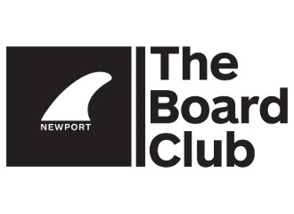

<div align="center">
<h1>Newport Board Club App Server</h1>
 <p align="center">
  
<h4>NodeJS backend server to support both the PWA and React Native version of the Newport Board Club App.</h4>
</div>

<br>
<br>

## Table-of-Contents

* [Installation](#installation)
* [Software Stack](#softwarestack)
* [Hardware/Deployment](#hardwaredeploy)


## [Installation](#table-of-contents)

* Server/API
```
    1) npm run buildServer
    2) npm run startServer
```

## [Software Stack](#table-of-contents)

* **Databases**
  * MongoDB (non-relational)
    * User
    * Events
    * Surf Sessions
    * Surf Hacks
    * Surfboard Shapers

<br>

* **Server** (Node 18.6.0)
  * Packages
    * @apollo/server (4.7.4)
    * @aws-sdk/credential-providers (3.369.0)
    * @aws-sdk/hash-node (3.369.0)
    * @aws-sdk/protocol-http (3.369.0)
    * @aws-sdk/s3-request-presigner (3.369.0)
    * @aws-sdk/url-parser (3.369.0)
    * @aws-sdk/util-format-url(3.369.0)
    * aws-sdk (2.1414.0)
    * bcrypt (5.1.0)
    * body-parser (1.20.2)
    * cors (2.8.5)
    * dotenv (16.3.1)
    * express (4.18.2)
    * graphql (16.6.0)
    * graphql-http (1.19.0)
    * json (11.0.0)
    * jsonwebtoken (9.0.0)
    * mongodb (5.6.0)
    * mongoose (7.3.0)
    * node-fetch (2.6.11)
    * react (18.2.0)

<br>

## [Hardware/Deployment](#table-of-contents)

* Railway (Cloud Host)
  * Client: https://boardclubapp-production.up.railway.app/
  * API: https://boardclubapp-production-api.up.railway.app/
  <br>
* Database (Self Host)
  * MongoDB
  <br>
* GitHub (Verison Control)
  * https://github.com/DesertCow/boardClubApp
  <br>
* AWS (S3)
  * US West 1

<br>
<br>